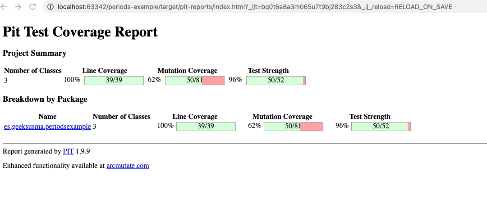
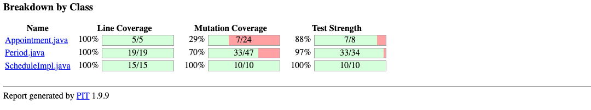
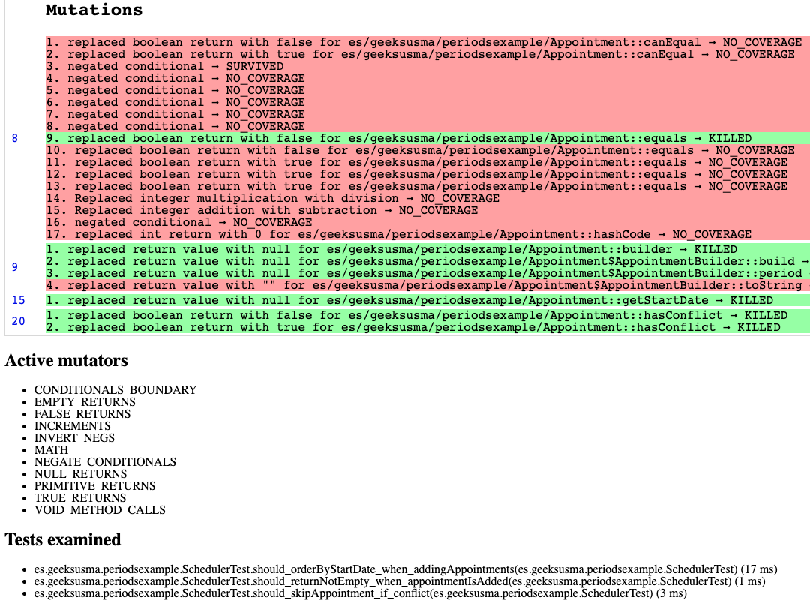
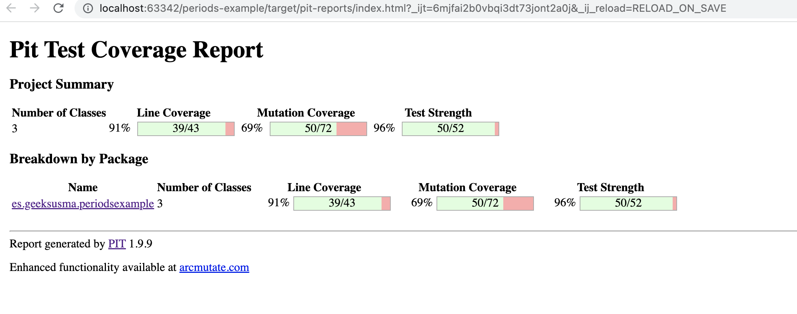

# Mutants Experiment!

I tried to test my skills building components using TDD, a good way to achieve this is
using Mutation Tests.
    
## Why Mutation Tests?

Some people tend to think having a test coverage up to 90% is fine, but it brings a
fake feeling of being safe, since "almost all the code is tested". But the question here is
How good are those tests?

Well I have saw several times in my career how projects built based on only having a good coverage metric, later
they were totally unsafe, with a lot of production issues and hotfixing. The reason is simple, those test were written
like "eh, let's pass the coverage and cheat the Sonar", and they were not written to discover/tests behaviours

Even coding following a TDD approach, when having a high code coverage is a consequence of following that approach, is better
to have a double check in order to be completely sure you are not missing any scenario.

Then you need to check how strength are your tests, and Mutation tests are useful for that.

### What is a Mutant?

When we're adding mutants to our codebase via mutation testing, in fact the mutation testing is updating the bytecode of the production codebase,
finally based on how many test are written, it is smart enough to create a report in order to let us know:

* If there is any missed test pending to be written
* How strong are the tests we already have

That bytecode alteration is based on, for example, replacing a "==" by ">=" operator, neglecting ifs thinks like that, 
here you can find a good summary of mutators

A better documentation can be found [here](https://pitest.org/), just in case you want to go a bit further.

## The experiment :man_technologist:

I created this repo some time ago as a session to model a [non-anemic model](https://martinfowler.com/bliki/AnemicDomainModel.html) using TDD. In fact the idea behind this repo was to introduce some concepts
from [DDD](https://martinfowler.com/tags/domain%20driven%20design.html) but, as sometimes happens, this project is an abandoned one.

But since the value objects and a service were built, I tried to check how good my TDD approach was. So I added PIT as a plugin to let me run some Mutation tests over my code. The results were interesting, and I was able to reach some conclusions

### First Try. Mutants are alive!!!

Running the Mutation Tests at **7c584799** commit, the next report is generated:

As you can see, there are a high number of Mutants alive. Remember, a non killed Mutant is probably missed tested (or not well tested) code, 
so every alive mutant needs to be reviewed.

#### The Lombok problem

As you can see in the next screenshots, all my mutants are alive in code not "written" at any place. Since all those mutants
are affecting to equals, hashcode, canEqual, getXXX or so.. the first temptation could be to tune the library in order to exclude
those methods from the report, and it could be fine, but in fact, I don't like the feeling of having Mutants in code that I can't review,
so I started to remove Lombok from the project.

Why this project has [Lombok](https://projectlombok.org/)?

Well, I was a fan of Lombok some years ago, but nowadays, I don't like it anymore. But since I wanted to test Mutation in a
"legacy" project, it makes sense to find Lombok here, based on my past likes.

### Replace lombok by boilerplate from IDE

Check those commits and the refactor done, and generating the Mutation Test report commit by commit, will let you check how 
the only metric that is getting higher is the "test strength", is true the Mutation Testing setup was changed in order to 
ignore equals/hashcode.

* Report for **c6b3927c**

* Report for **b521be14**

* Report for **95c9621f**

* Report for **fdf50568**

Some people can ask "and why don't you just tune the Mutation testing before to ignore those methods?" well the answer is quite
simple.

Using Lombok Annotations, it was not only about adding equals and hashcode, it was also adding out of the box methods like "canEqual",
or "toString". And those methods they were never used from my code, I can say it was adding "more stuff than expected", and
as more methods are magically added, more mutants can survive.

The second thought is, ok if I only want to have equals and hashcode (and some builders) then why not add them manually
or using the IDE? If now those methods are going to be evaluated, I'd like to, at least, be able to check how good that code is.

### Replace Getter by Domain Logic

Finally, at this commit, you can see how, an autogenerated getter now it becomes a business method (of course with a single line) 
but with meaning inside the domain. It was important to do the refactor in that way. Having just a getter it could lead 
to an anemic model, and that is not what I want.

But the thing is after that commit, you can see how no more Mutants are alive, and finally I had a 100% of Test Strength 
without changing any behaviour, so it seems all the TDD done some years ago, was good enough

### Final conclusions

Mutation testing are an excellent tool to measure how good are your tests, but also they can provide to fantastic insights
for your boilerplate code.

I'd like to check how Mutation tests behave in a large project, but at least in my opinion, worth to take it into account 
as part of your [CI/CD](https://medium.com/trendyol-tech/pit-mutation-testing-on-ci-cd-pipeline-1298f355bae5). Having Mutants must be a good reason to mark a build as failed since it means, there is something 
forgotten in your codebase

Finally, be careful with libraries and/or autogenerated code, it can be the perfect nest for your Mutants.